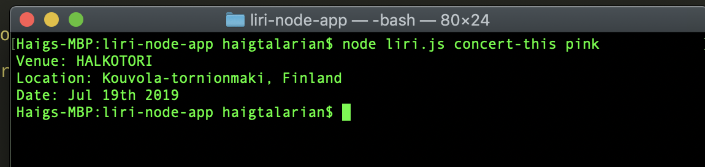
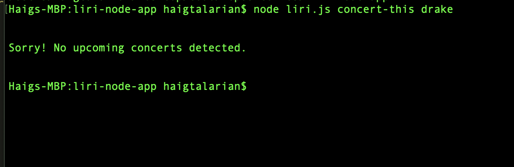
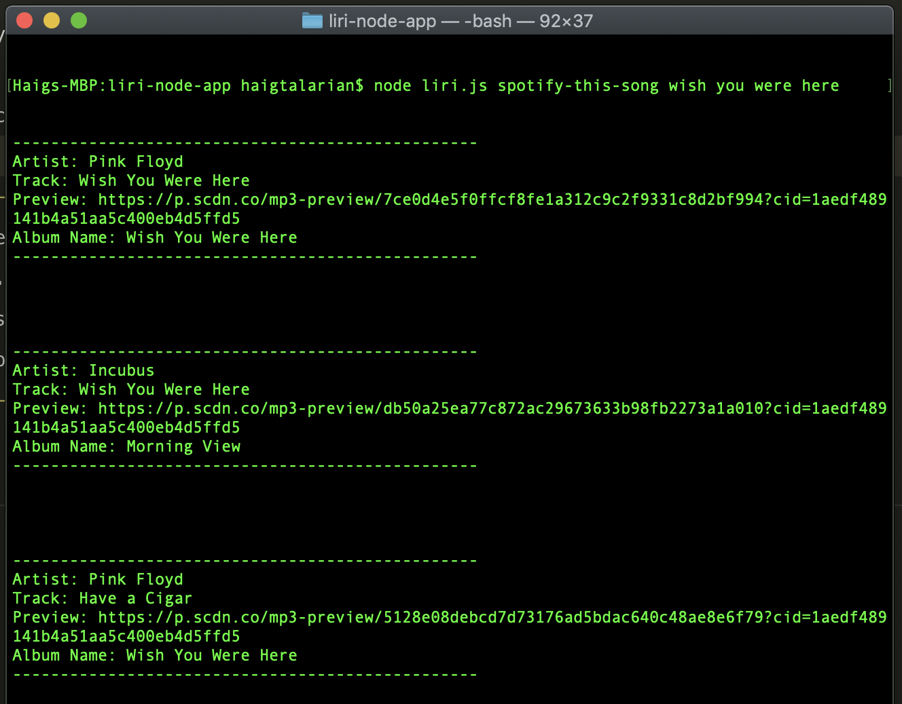

# What is LIRI?

Instead of asking *what* is LIRI, you should be asking *who* is LIRI...? LIRI is like the iPhone's SIRI. However, while SIRI is a Speech Interpretation and Recognition Interface, LIRI is a _Language_ Interpretation and Recognition Interface. LIRI is a command line node application that will take in parameters from the user and return some data.

## How does it work?

LIRI can currently take in 4 different commands. Those commands are `concert-this`, `spotify-this-song`, `movie-this`, and `do-what-it-says`. First you want to navigate to the directory that liri is in like so -

### Concert This

We can start with the `concert-this` command. Simply type `concert-this` followed by the name of an artist or a band and LIRI will tell you if they have any concerts coming up. If no concerts are detected by LIRI, she will tell you so. These screenshots will clear up any confusions you may have -

The user searched for Pink and LIRI returns some data about an upcoming Pink concert!

However, if you search for an artist with no concerts coming up, you'll see something like this... 

### Spotify This Song

Our next command for LIRI is the `spotify-this-song` command. Much like the previous command, simply type in `spotify-this-song` followed by the name of a song. You may also search for an artist *or* an artist/song combination to be more precise. LIRI will only return 3 results so its best to be more specific. You can enter multiple words as the search parameter, no quotes are necessary. LIRI will return the closest results possible so chances are you won't get an error message for this one. Here's a screenshot to clear things up - 

